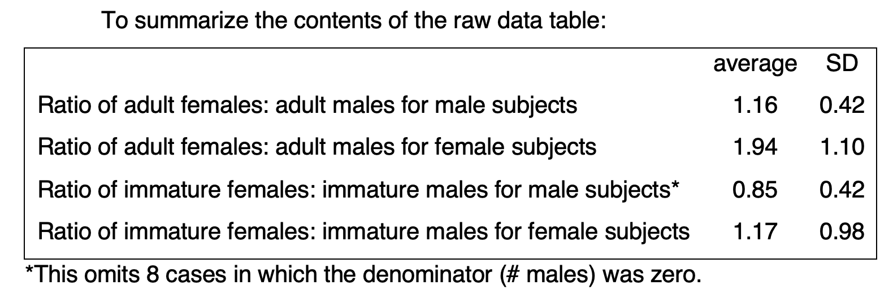
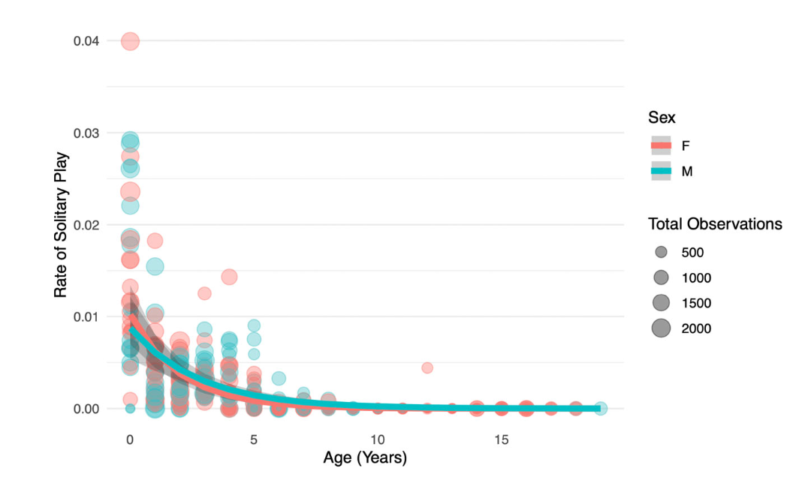

``` {r setup, include=FALSE}
knitr::opts_chunk$set(echo = TRUE, warning = FALSE, comment = "##", prompt = TRUE, tidy = TRUE, tidy.opts = list(width.cutoff = 75), fig.path = "img/")
```
# Winkler Data

<center>
<iframe width="560" height="315" src="https://www.youtube.com/embed/OkkkPAE9KvE?si=5Ds0M6_y8qgL9nAh" data-external= "1"></iframe>
</center>

## Introduction
In 2021, Sasha L. Winkler and Susan E. Perry published an article in the American Journal or Primatology studying sex differences in play in wild Capuchins. The study was important because it is one of the first longitudinal study of play behavior in any primate. The authors collected and compiled 18 years worth of data detailing the approximated age of a focal Capuchin along with the amount of social play, solitary play and grooming it engaged in. The authors used this data and ran a series of generalized linear mixed models, considering both linear and quadratic effects of age. From this, they were able to pick three optimal models for each of the three behavioral play types based on sex and age predictors.

For this replication assignment, I will be replicating three statistics. 
<br>The first is a descriptive table showing the rate of play with different sexes. 
<br>The second is an inferential statistic in which I run multiple glmm models and find the best ones to describe social play, solitary play and grooming. 
<br>Finally, I replicate a figure showing the sex differences in solitary play behavior both with the actual data and the generated model. The authors found that 'at no age do male and female solitary play rates show biologically meaningful differences from one another'.

## Install Packages

Let's first load in all the packages needed!
``` {r install_packages, results='hide', warning=FALSE,message=FALSE}
library(formatR)
library(openxlsx)
library(curl)
library(kableExtra)
library(gridExtra)
library(ggplot2)
# To replicate the inferential glmm, I will use lme4.
library(lme4)
library(merTools)
library(matrixStats)
```

## Descriptive Statistic

To begin, I will read in the first dataset provided by Winkler and Perry. Their excel file has 3 sheets, each with their own datasets. For our descriptive statistic I will be using data that covers what kinds of individuals (adult female, adult male, immature female, immature male) a focal plays with, found in the *Winkler_play_sex_dataset* sheet.

```{r read in data}
winkler_data <- read.xlsx("http://raw.githubusercontent.com/ritikasibal/rsibal-data-replication-assignment/main/Winkler_Perry_dataset_with_codebook.xlsx", sheet = 'Winkler_play_sex_dataset')
head(winkler_data)
```

As you can see, this tibble shows us the distribution of interactions between individuals. 

Next, in the supplementary information provided by the paper, the following table was given. For this first section, I will attempt to replicate this table and its statistics, which requires finding ratios for each focal type. 

<br>
\
<br>

```{r descriptive}
# Lets create a function to parse through our data and calculate the ratios
get_ratios <- function(var1, var2, focal, data){
    ratios <- c()
    for(i in 1:nrow(data)) {
      # check for the focal sex, and also that the denominator is not 0 (based on what the authors did)
      if(data[i,]$Sex == focal && data[[i,var2]] != 0){
        ratios <- c(ratios,data[[i,var1]]/data[[i,var2]])
      }
    }
    return(c(mean=mean(ratios), sd=sd(ratios)))
}

# Ratio of adult females: adult males for male subjects
desc_1 <- get_ratios("Mean.#.adult.females", "Mean.#.adult.males", 'm', winkler_data)

# Ratio of adult females: adult males for female subjects
desc_2 <- get_ratios("Mean.#.adult.females", "Mean.#.adult.males", 'f', winkler_data)

# Ratio of immature females: immature males for male subjects
desc_3 <- get_ratios("Mean.#.immature.females", "Mean.#.immature.males", 'm', winkler_data)

# Ratio of immature females: immature males for female subjects
desc_4 <- get_ratios("Mean.#.immature.females", "Mean.#.immature.males", 'f', winkler_data)

# Create a single dataframe from all our ratio values 
df <- data.frame(Type=c("Ratio of adult females: adult males for male subjects", "Ratio of adult females: adult males for female subjects", "Ratio of immature females: immature males for male subjects", "Ratio of immature females: immature males for female subjects"), Mean=c(desc_1[1], desc_2[1], desc_3[1], desc_4[1]), Sd=c(desc_1[2], desc_2[2], desc_3[2], desc_4[2]))

# Create a table from our data frame, save it in the /img directory
knitr::kable(df, format = "html", digits=2) %>%
kable_styling()
```

``` {r save table, include = FALSE}
png("img/Descriptive Stat Winkler.png", height = 50*nrow(df), width = 200*ncol(df))
grid.table(df)
```

<br> My calculated values are slightly different to the ones given by the authors in the supplementary information. Initially, I was not sure if this was an error on my part. However, after combing through my logic, I also double checked the values using excels inbuilt average() and sd() functions and found the same values as what I had calculated in my script. These differences are not huge, so it is likely the authors either omitted more outliers for their calculation (based on judgement calls or other criteria) or simply did not give us access to the actual values they used for their calculation.

Additionally, the authors disclosed that they chose to omit values where the denominator of the ratio was 0. I think this omission might not be best practice. Alternatively, the authors could have added 1 to each value (so there are no more zeros) and then remove 1 from the end (after ratios, mean and sd are calculated) to standardize and re-balance the data. This would prevent any need for omission.

## Inferential Statistic

First, I will read in the dataset.
```{r read in data 2}
winkler_data <- read.xlsx("http://raw.githubusercontent.com/ritikasibal/rsibal-data-replication-assignment/main/Winkler_Perry_dataset_with_codebook.xlsx", sheet = 'Winkler_Perry_dataset')
head(winkler_data)
```

The authors used a few non intuitive abbreviations to code their data. For the sake of convince, I will print out there code book here

``` {r codebook}
knitr::kable(read.xlsx("http://raw.githubusercontent.com/ritikasibal/rsibal-data-replication-assignment/main/Winkler_Perry_dataset_with_codebook.xlsx", sheet = 'codebook'))
```

<br>'To determine sex differences in the rates of each behavior and how they change over the lifespan', the authors ran a series of generalized linear mixed models, with **outcome variables**=*social play, solitary play, and grooming*,  **predictor variables**=*sex, age, and the interaction between sex and age* and **random effect**=*individual* which accounted for repeated sampling for each individual over time. I will attempt to do the same!

The authors disclosed that they found that a 'negative binomial provided the best fit for social play, solitary play and grooming'. Let's see if we find the same thing.

```{r inferential statistic, social play}
# SOCIAL PLAY
# Use .nb for negative binomial glmm
sp_model1 <- glmer.nb(formula = sp ~ year + sex + year*sex + (1 | focal), data = winkler_data)
# Poisson Model
sp_model2<- glmer(formula = sp ~ year + sex + year*sex + (1 | focal), data = winkler_data, family = "poisson")
# Create dataframe from AIC and BIC values
df1 <- data.frame(Model_Type=c('negative binomial', 'poisson'), AIC=c(summary(sp_model1)$AIC[1], summary(sp_model2)$AIC[1]), BIC=c(summary(sp_model1)$AIC[2], summary(sp_model2)$AIC[2]))

#GROOMING
# Use .nb for negative binomial glmm
sm_model1 <- glmer.nb(formula = sm ~ year + sex + year*sex + (1 | focal), data = winkler_data)
# Poisson Model
sm_model2<- glmer(formula = sm ~ year + sex + year*sex + (1 | focal), data = winkler_data, family = "poisson")
# Create dataframe from AIC and BIC values
df2 <- data.frame(Model_Type=c('negative binomial', 'poisson'), AIC=c(summary(sm_model1)$AIC[1], summary(sm_model2)$AIC[1]), BIC=c(summary(sm_model1)$AIC[2], summary(sm_model2)$AIC[2]))

#SOLITARY PLAY 
# Use .nb for negative binomial glmm
wp_model1 <- glmer.nb(formula = wp ~ year + sex + year*sex + (1 | focal), data = winkler_data)
# Poisson Model
wp_model2<- glmer(formula = wp ~ year + sex + year*sex + (1 | focal), data = winkler_data, family = "poisson")
# Create dataframe from AIC and BIC values
df3 <- data.frame(Model_Type=c('negative binomial', 'poisson'), AIC=c(summary(wp_model1)$AIC[1], summary(wp_model2)$AIC[1]), BIC=c(summary(wp_model1)$AIC[2], summary(wp_model2)$AIC[2]))
```

``` {r printresults,echo=FALSE}
knitr::kable(df1, format = "html", caption="Social Play Models")
knitr::kable(df2, format = "html", caption="Grooming Models")
knitr::kable(df3, format = "html", caption="Solitary Play Models")
```

<br> Comparing the AIC and BIC values for all three outcome variables of *social play, solitary play, and grooming* we see that the AIC and BIC values for all three are lower in the negative binomial model, meaning that it is a better fit. This is consistent with what the authors found! A negative binomial model accounts for a variance of the data is higher than the mean.

For fun, I wanted to see how the created model would hold up against real data for time spent social playing. To do this I used the simulate() function that we learned about in class. I then plotted the simulated data against the real values collected from the field. 

``` {r Testing Model Winkler}
# We are simulating so lets set the seed
set.seed(4)
# Found this here: https://cran.r-project.org/web/packages/glmmTMB/vignettes/sim.html
ss_simlm <- transform(winkler_data,Reaction = simulate(sp_model1)[[1]])

# Copy the data so we can still use the original dataset later
winkler_data_copy <- winkler_data
# Add the simulated data into the dataset copy
winkler_data_copy$simulated <-ss_simlm$Reaction
# Plot! Year on X and Real vs Simulated on Y
ggplot(winkler_data_copy, aes(x=year)) + 
  geom_point(aes(y = sp, color="Real")) +
  geom_point(aes(y = simulated, color="Simulated")) +
  scale_colour_manual(values=c("#aed6f1", "#D2B4DE")) +
  theme(axis.ticks.x=element_blank(), panel.border = element_blank(), panel.grid.major = element_blank(), panel.grid.minor = element_blank(), axis.line = element_line(colour = "black"), panel.background = element_blank()) + ylab("Social Play") + xlab("Age")
```

Over all our model looks pretty great, it follows the trend of the original data quite well!

## Figure Statistic

I choose to replicate the solitary play figure because, based on the papers findings, it was the only model that did not use a quadratic predictor variable. This way, I was able to use the models based on my analysis in the previous section. Because of this however, I plotted the frequency of solitary play instead of the ratio of solitary play to total observations, as getting a good predictor total observation value would have required generating many more glmm models. The graph shows the same trend as seen in the paper. 

``` {r Figure Stat Winkler}
# Create a data frame for the predictor varibales
pred_data = expand.grid(focal='AH',sex=c('m', 'f'), 
                        year=unique(winkler_data$year))
# Predict! re.form=NA allows us to randomise for focal too
pred_data$wp_pred <- predict(wp_model1, newdata=pred_data, type = "response", re.form=NA)

# This is needed to use bootMer
temp_function <- function(glmm) {
    predict(glmm, newdata = pred_data, re.form=NA, type="response")
}

# The authors used bootMer to calculate their confidence intervals so I chose to use that too. 
bt <- bootMer(wp_model1, temp_function, nsim=100, re.form=NA)
std_err <- colSds(bt$t)
pred_data$lwr <- pred_data$wp_pred  - std_err*1.96
pred_data$upr <- pred_data$wp_pred  + std_err*1.96

# Plot! Year on X axis and Play on Y
# Used https://www.color-hex.com to find the exact colors!
# size = total in geom_point will change the points to reflect the total observations
ggplot() + 
  geom_point(data=winkler_data, aes(x=year, y=wp, color=sex, size=total), alpha=0.3) +
  scale_size(name = "Total Observations", range = c(.5, 4)) +
  theme(axis.ticks.x=element_blank(), panel.border = element_blank(), panel.grid.major = element_blank(), panel.grid.minor = element_blank(), axis.line = element_line(colour = "black"), panel.background = element_blank()) +
  ylab("Rate of Solitary Play") + 
  xlab("Age (years)") +
  geom_line(data=pred_data, aes(x=year, y=wp_pred, colour=sex), size=1.1) +
    scale_colour_manual(values=c("#00c8d3", "#ff686b"), labels = c("F", "M"), name = "Sex") + 
  geom_ribbon(data=pred_data, aes(x=year, ymin = lwr, ymax = upr), alpha = 0.25, linetype = 0)
```
``` {r remove all data, include = FALSE}
# References:
#https://stackoverflow.com/questions/66655938/change-size-of-geom-point-based-on-values-in-column

# Lets remove all our variables before we start our next  analysis
rm(list=ls())
```

And here is the original figure to compare!

<br>
\
<br>

# Knott Data

<center>
<iframe width="560" height="315" src="https://www.youtube.com/embed/MFQS7kOCwoI?si=lEeuV1wEiueOqvrC" data-external= "1"></iframe>
</center>

## Introduction 
As I have some coding experience, to challenge myself for this assignment I not only replicated figures but decided to conduct my own statistical analysis. As glmms are a very new concept for me, I thought that trying to use them would be a welcome challenge!

Since I am a part of Dr. Cheryl Knott's lab, I asked her whether there was any longitudinal data that I could take a look at. For my thesis, I will broadly be focued on characterising orangutan locomotion through pose estimation, so for this analysis Dr. Knott thought it would be beneficial to study the ontogeny of locomotion in the Bornean Orangutan. 
Dr. Knott had a 20 year data set characterising oranguatan Age, Body Position, Tree Position, Tree Height, Act type along with Pheno data (where act type is a description of the locomotion data (e.g. Eat)). For this analysis, I wanted to see if there was a good way to predict Act type in relation to Age, with the prediction that infant and juvenile orangutans have a wider array of postures 'acting' when compared to adults

To do this, I decided to compare three different model types:
<br>1. Neural Network
<br>2. randomForest
<br>3. MCMCglmm (Markov chain Monte Carlo glmm)
<br>With different predictor variables. The outcome variable ('Act type') of all these analysis will be multinomial and categorical. 

## Install Packages

Let's begin by installing all required packages again!
``` {r install_packages Knott, results='hide', warning=FALSE,message=FALSE}
library(openxlsx)
library(rsample)
library(randomForest)
library(dplyr)
library(caret)
library(nnet)
library(MCMCglmm)
```

## Read in Data
Let's read in the data and visualize what it actually looks like.  
``` {r read in data Knott}
knott_data <- read.xlsx("http://raw.githubusercontent.com/ritikasibal/rsibal-data-replication-assignment/main/OntogenyOfLocomotion.xlsx")
head(knott_data)

# We will remove the "CariRayap" act type as it is too specific and can be placed under "Travel"
knott_data <- knott_data[!grepl("CariRayap", knott_data$Act),]
# Omit all NAs
knott_data <- na.omit(knott_data)
```

## Descriptive Statistic
Great! Now that we know what the data looks like, lets do a preliminary visualization of the act differences between infant and adult orangutans. To do this, I will filter the data for infant (less than 5 years) and adults (more than 14 years) and look at the differences in rate of locomotion

``` {r Descriptive Stat Knott}
IandA_df <- data.frame(Act=unique(knott_data$Act))
# Infant age: up to 5
infant <- knott_data[knott_data$Age < 5, ]
eat_i <- sum(infant[infant$Act == 'Eat', 'Percent'])/NROW(infant[infant$Act == 'Eat', 'Percent'])
rest_i <- sum(infant[infant$Act == 'Rest', 'Percent'])/NROW(infant[infant$Act == 'Rest', 'Percent'])
travel_i <- sum(infant[infant$Act == 'Travel', 'Percent'])/NROW(infant[infant$Act == 'Travel', 'Percent'])
play_i <- sum(infant[infant$Act == 'Play', 'Percent'])/NROW(infant[infant$Act == 'Play', 'Percent'])
cling_i <- sum(infant[infant$Act == 'Cling', 'Percent'])/NROW(infant[infant$Act == 'Cling', 'Percent'])
IandA_df$Infant <- c(eat_i, rest_i, travel_i, play_i, cling_i)
IandA_df$Infant[is.nan(IandA_df$Infant)] <- 0

# Juvenile age: 5-14
juv <- knott_data[(knott_data$Age > 5) & (knott_data$Age < 14),]
eat_j <- sum(juv[juv$Act == 'Eat', 'Percent'])/NROW(juv[juv$Act == 'Eat', 'Percent'])
rest_j <- sum(juv[juv$Act == 'Rest', 'Percent'])/NROW(juv[juv$Act == 'Rest', 'Percent'])
travel_j <- sum(juv[juv$Act == 'Travel', 'Percent'])/NROW(juv[juv$Act == 'Travel', 'Percent'])
play_j <- sum(juv[juv$Act == 'Play', 'Percent'])/NROW(juv[juv$Act == 'Play', 'Percent'])
cling_j <- sum(juv[juv$Act == 'Cling', 'Percent'])/NROW(juv[juv$Act == 'Cling', 'Percent'])
IandA_df$Juvenile <- c(eat_j, rest_j, travel_j, play_j, cling_j)
IandA_df$Juvenile[is.nan(IandA_df$Juvenile)] <- 0

# Adult age: 14 and older
adult <- knott_data[knott_data$Age >= 14, ]
eat_a <- sum(adult[adult$Act == 'Eat', 'Percent'])/NROW(adult[adult$Act == 'Eat', 'Percent'])
rest_a <- sum(adult[adult$Act == 'Rest', 'Percent'])/NROW(adult[adult$Act == 'Rest', 'Percent'])
travel_a <- sum(adult[adult$Act == 'Travel', 'Percent'])/NROW(adult[adult$Act == 'Travel', 'Percent'])
play_a <- sum(adult[adult$Act == 'Play', 'Percent'])/NROW(adult[adult$Act == 'Play', 'Percent'])
cling_a <- sum(adult[adult$Act == 'Cling', 'Percent'])/NROW(adult[adult$Act == 'Cling', 'Percent'])
IandA_df$Adult <- c(eat_a, rest_a, travel_a, play_a, cling_a)
IandA_df$Adult[is.nan(IandA_df$Adult)] <- 0

ggplot() + 
  geom_point(data=IandA_df, aes(x=Act, y=Adult, color="#a1b88d", label=Adult, size=1), alpha=0.5) +
  geom_point(data=IandA_df, aes(x=Act, y=Infant, color="#fac6d9", label=Infant, size=1),alpha=0.5) +
  geom_point(data=IandA_df, aes(x=Act, y=Juvenile, color="#330066", label=Juvenile, size=1),alpha=0.5) +
  scale_colour_manual(values=c("#a1b88d", "#fac6d9", "#330066"), labels = c("Juvenile", "Adult", "Infant"), name = "Age") +   theme(axis.ticks.x=element_blank(), panel.border = element_blank(), panel.grid.major = element_blank(), panel.grid.minor = element_blank(), axis.line = element_line(colour = "black"), panel.background = element_blank()) +
  ylab("Percent of Time Spent in Act") + 
  xlab("Act Type") +
  scale_size_continuous(guide = "none")
```

This is very interesting! We are seeing some potential age related differences. Obviously, only infants (and sometimes juveniles) cling. But it looks like infants are spending more time, proportionally, eating and playing--consistent with what we know about development. However, they are spending the same amount of time resting and traveling, which makes sense again because they are traveling with adults (moms) and thus matching their rate! Juveniles seems to be in the middle of the two.


## Neural Networks and RandomForests

To attempt to predict Act type as an outcome, I will be running a neural network. For this, I choose predictor variables of Age, Body position (BP) and Tree Position (TP) as I thought they were the most likely to effect Act. Though I did not add this code here, I also tried predictor variables of PhenoNum, PhenoSum and Height but found that they worsened the model. I was also interested, personally, whether BP could also be characterised by Age and so ran a neural network for that as well.

I also wanted to see if other predictive models would be better suited to this type of analysis. To do that, I reran both the formulas with randomForest.

So, that gave me two questions:
<br> 1. With BP, TP and Age, will we be able to predict what Act the focal individual is performing?
<br> 2. With Age, Tree Height, TP, will we be able to predict the body position of the individual?

<br> Lets find out!

```{r Figure Stat Knott, results='hide'}
# Set the seed again as we are random sampling
set.seed(12345678)

# Make the data into factors
knott_data[sapply(knott_data, is.character)] <- lapply(knott_data[sapply(knott_data, is.character)], as.factor)

# 60% to train and 40% to test our models on! 
split_1  <- initial_split(knott_data, prop = 0.6)
train_1  <- training(split_1)
test_1  <- testing(split_1)

# NN: Finding Act as it relates to Age + TP + BP, I had to play around to see if any quadratic variables helped the model
model_nn <- nnet(formula=Act ~ Age + Age*Age + TP + BP + BP*Age + TP*BP, data = train_1, size=12)
pred_nn_1 <- predict(model_nn, test_1, type="class")
pred_nn_1 <- factor(pred_nn_1,levels = levels(test_1$Act))

# NN: Finding BP as it relates to  Age + Height + TP
model_nn <- nnet(formula=BP ~ Age + Height + TP, data = train_1, size=5)
pred_nn_2 <- predict(model_nn, test_1, type="class")
pred_nn_2 <- factor(pred_nn_2,levels = levels(test_1$BP))

# RF: Finding Act as it relates to Age + TP + BP, I had to play around to see if any quadratic variables helped the model
rf <- randomForest(formula=Act ~ Age + Age*Age + TP + BP + BP*Age + TP*BP, data = train_1)
pred_nn_3 <- predict(rf, test_1, type="class")
pred_nn_3 <- factor(pred_nn_3,levels = levels(test_1$Act))

# RF: Finding BP as it relates to  Age + Height + TP
rf <- randomForest(formula=BP ~ Age + Height + TP, data = train_1)
pred_nn_4 <- predict(rf, test_1, type="class")
pred_nn_4 <- factor(pred_nn_4,levels = levels(test_1$BP))
```

``` {r model results Knott}
# NN Age + Age*Age + TP + BP + BP*Age + TP*BP
confusionMatrix(as.factor(test_1$Act), as.factor(pred_nn_1))
# NN BP ~ Age + Height + TP
confusionMatrix(as.factor(test_1$BP), as.factor(pred_nn_2))
# RF Age + Age*Age + TP + BP + BP*Age + TP*BP
confusionMatrix(as.factor(test_1$Act), as.factor(pred_nn_3))
# RF BP ~ Age + Height + TP,
confusionMatrix(as.factor(test_1$BP), as.factor(pred_nn_4))
```

From these results, it looks like both the neural network model and randomForest models are comparable. When looking at efficacy, I paid special attention to the *Accurary* and *Balanced Accuracy* in the confusionMatrix, as well as *P-Value [Acc > NIR]*. *P-Value [Acc > NIR]* is a one tailed test that tells us whether the prediction accuracy is higher than the "no information rate", which is basically picking the highest frequency outcome every time. The *P-Value [Acc > NIR]* is close to significant for the neural network with the *Age + AgexAge + TP + BP + BPxAge + TPxBP* formula but not quite.

Based on the accuracies provided by our confusion matrix it seems that *Age + AgexAge + TP + BP + BPxAge + TPxBP* is the best formula, giving us an accuracy of 65%. This means that Age, Tree position, and Branch position are the best predictors of Act type.

Let's visualize what our predictions actually look like when compared to the actual data!

``` {r plot NN Knott}
sampledf <- data.frame(Age=test_1$Age, Actual=test_1$Act, Prediction=pred_nn_1)
sampledf <- slice_sample(sampledf, n=100)

ggplot() + 
  geom_jitter(data=sampledf, aes(y=Age, x=Actual, color="#000080"), alpha=0.2, width = 0.2, size = 1) +
  geom_jitter(data=sampledf, aes(y=Age, x=Prediction, color="#e60012"),alpha=0.2, width = 0.2, size = 1) + scale_colour_manual(values=c("#000080", "#e60012"), labels = c("Actual", "Prediction"), name = "Data Type") +  
  theme(axis.ticks.x=element_blank(), panel.border = element_blank(), panel.grid.major = element_blank(), panel.grid.minor = element_blank(), axis.line = element_line(colour = "black"), panel.background = element_blank()) +
  guides(colour = guide_legend(override.aes = list(size=5))) +
  ylab("Age") + 
  xlab("Act Type") +
  scale_size_continuous(guide = "none")
```

Makes sense! From our confusion matrices we saw that Travel and Rest has the best accuracy based on our predictor variables. In the plot, we see that both blue and red (Actual vs Predicted) points are heavily clustered together for Rest and Travel, where as there are a lot more lone and dispersed blue dots for Cling and Eat, meaning that the model did not do a good job at predicting those. 

## MCMCglmm

A 65% accuracy is okay, and it is possible it is so low because we haven't taken into account the random effect of individual. In order to do that, we would need to do use a glmm. But, glmms don't allow outcome variables that are categorical with multiple categories, which we have. The Act variable can be one of 6 different values. During my research, I found out about MCMCglmms which do allow for multinomial categorical output variables!

MCMCglmms use a bit of Bayesian statistics, which often requires a prior. Since I was really unsure about my data and the relationships between variables, I used the default prior which is very very generous. Something else to note is the nitt and burnin rates which are the baseline recommended rates, 3000 simulations will be burned from the total 100000!

``` {r Inferential Stat Knott}

model_mcmc_1 <- MCMCglmm(Act ~ Age + TP + BP,
                  random = ~Follow+Name+Date, 
                  rcov = ~us(trait):units,
                  family = "categorical",
                  data     = knott_data,
                  nitt     = 100000,
                  pr=TRUE)

summary(model_mcmc_1)

model_mcmc_2 <- MCMCglmm(Act ~ Age + Age*Age + TP + BP + BP*Age + TP*BP,
                  random = ~Follow+Name+Date, 
                  rcov = ~us(trait):units,
                  family = "categorical",
                  data     = knott_data,
                  nitt     = 100000,
                  pr=TRUE)

summary(model_mcmc_2)

par(mar = c(1, 1, 1, 1), ps = 7)
# lets see if our models are good!
plot(model_mcmc_1$VCV, xaxt="n")
plot(model_mcmc_2$VCV, xaxt="n")

df <- data.frame(model=c("Model 1", "Model 2"), DIC=c(model_mcmc_1$DIC, model_mcmc_2$DIC))
knitr::kable(df, format = "html", caption="MCMCglmm Models")
```
<br> The things to look out for here are 1) whether our models are mixed. This should look like a 'caterpillar' with a distinct middle line, in our plots. 2) the DIC value (which will be lower for better models).

Based on that, it seems like *Act ~ Age + AgexAge + TP + BP + BPxAge + TPxBP* is the best formula for the prediction as it plots look better samples and the DIC value for this model!

## Conclusion
Now that we have a few decently predictive models, my next step will be to re-organise and re-filter the data and run them through the models again. I'd also like to take into account sex in the future, to see if it can also predict Act type, but that will require me to comb through the data again as some fields have "infant" or "juvenile" but no sex data. Lastly, I thought it would be cool if I can describe a state machine for each of the age groups to see the transitions between motions!