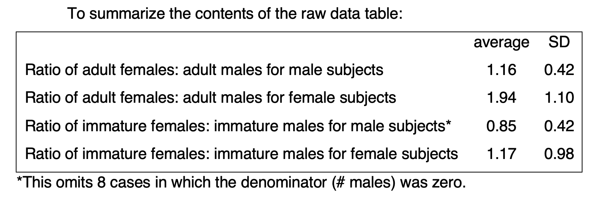

``` {r setup, include=FALSE}
knitr::opts_chunk$set(echo = TRUE, warning = FALSE, comment = "##", prompt = TRUE, tidy = TRUE, tidy.opts = list(width.cutoff = 75), fig.path = "img/")
```
# Winkler Data

## Descriptive Statistic

To begin, I will read in the first dataset.
```{r read in data}
library(readxl)
winkler_data <- read_excel(file.path(getwd(), "Winkler_Perry_dataset_with_codebook.xlsx"), sheet = 'Winkler_play_sex_dataset')
head(winkler_data)
```

In the supplementary information linked to the paper, the following table was given. In the first section, I will attempt to replicate this table and its statistics. 

\

```{r descriptive}
library(kableExtra)
# create a function to parse through our data and calculate the ratios
get_ratios <- function(var1, var2, focal){
    ratios <- c()
    for(i in 1:nrow(winkler_data)) {
      # check for the focal sex, and also that the denominator is not 0 (based on what the authors did)
      if(winkler_data[i,]$Sex == focal && winkler_data[[i,var2]] != 0){
        ratios <- c(ratios,winkler_data[[i,var1]]/winkler_data[[i,var2]])
      }
    }
    return(c(mean=mean(ratios), sd=sd(ratios)))
}

# Ratio of adult females: adult males for male subjects
desc_1 <- get_ratios("Mean # adult females", "Mean # adult males", 'm')

# Ratio of adult females: adult males for female subjects
desc_2 <- get_ratios("Mean # adult females", "Mean # adult males", 'f')

# Ratio of immature females: immature males for male subjects
desc_3 <- get_ratios("Mean # immature females", "Mean # immature males", 'm')

# Ratio of immature females: immature males for female subjects
desc_4 <- get_ratios("Mean # immature females", "Mean # immature males", 'f')

# create a single dataframe from all out values 
df <- data.frame(Type=c("Ratio of adult females: adult males for male subjects", "Ratio of adult females: adult males for female subjects", "Ratio of immature females: immature males for male subjects", "Ratio of immature females: immature males for female subjects"), Mean=c(desc_1[1], desc_2[1], desc_3[1], desc_4[1]), Sd=c(desc_1[2], desc_2[2], desc_3[2], desc_4[2]))

# create a table from our data frame
knitr::kable(df, format = "html")
library(gridExtra)
png("img/table1.png", height = 50*nrow(df), width = 200*ncol(df))
grid.table(df)
```


<br> My calculated values a slighting different to the ones given in the supplementary information. Initially, I was not sure if this was an error on my part. However, after combing through my logic, I also double checked the values using excels inbuilt average and sd functions and got the same values as I calculated in my script. These differences are not huge, so it is likely the authors either omitted more values for their calculation (based on judgement calls or other criteria) or simply did not give us access to the actual values they used for their calculation.

The authors chose to omit values where the denominator of the ratio would be 0. I think this omission might not be best practice. Alternatively, authors could have added 1 to each value (so there are no ore zeros) and then remove 1 from the end (after ratios, mean and sd are calculated) to standardize and re-balance the data. This would prevent any need for omission.

## Inferential Statistic

First, I will read in the dataset.
```{r read in data 2, echo=FALSE, results='hide'}
winkler_data <- read_excel(file.path(getwd(), "Winkler_Perry_dataset_with_codebook.xlsx"), sheet = 'Winkler_Perry_dataset')
head(winkler_data)
```

The authors used a few non intuitive abbreviations to code their data. For the sake of convince, I will print out there code book here

``` {r codebook}
knitr::kable(read_excel(file.path(getwd(), "Winkler_Perry_dataset_with_codebook.xlsx"), sheet = 'codebook'))
```

Based on the paper, the authors ran a series of generalized linear mixed models, with **outcome variables**=*social play, solitary play, and grooming*,  **predictor variables**=*sex, age, and the interaction between sex and age* and **random effect**=*individual*, to account for repeated sampling for each individual over time 'to determine sex differences in the rates of each behavior and how they change over the lifespan'

Authors found that 'negative binomial provided the best fit for social play, solitary play and grooming.'

```{r inferential statistic, social play}
# To replicate this inferential, I will use *lme4*.
library(lme4)

# SOCIAL PLAY
# Use .nb for negative binomial glmm
sp_model1 <- glmer.nb(formula = sp ~ year + sex + year*sex + (1 | focal), data = winkler_data)

sp_model2<- glmer(formula = sp ~ year + sex + year*sex + (1 | focal), data = winkler_data, family = "poisson")

df1 <- data.frame(Model_Type=c('negative binomial', 'poisson'), AIC=c(summary(sp_model1)$AIC[1], summary(sp_model2)$AIC[1]), BIC=c(summary(sp_model1)$AIC[2], summary(sp_model2)$AIC[2]))

#GROOMING
# Use .nb for negative binomial glmm
sm_model1 <- glmer.nb(formula = sm ~ year + sex + year*sex + (1 | focal), data = winkler_data)

sm_model2<- glmer(formula = sm ~ year + sex + year*sex + (1 | focal), data = winkler_data, family = "poisson")

df2 <- data.frame(Model_Type=c('negative binomial', 'poisson'), AIC=c(summary(sm_model1)$AIC[1], summary(sm_model2)$AIC[1]), BIC=c(summary(sm_model1)$AIC[2], summary(sm_model2)$AIC[2]))

#SOLITARY PLAY 
# Use .nb for negative binomial glmm
wp_model1 <- glmer.nb(formula = wp ~ year + sex + year*sex + (1 | focal), data = winkler_data)

wp_model2<- glmer(formula = wp ~ year + sex + year*sex + (1 | focal), data = winkler_data, family = "poisson")

df3 <- data.frame(Model_Type=c('negative binomial', 'poisson'), AIC=c(summary(wp_model1)$AIC[1], summary(wp_model2)$AIC[1]), BIC=c(summary(wp_model1)$AIC[2], summary(wp_model2)$AIC[2]))
```
``` {r printresults,echo=FALSE}
knitr::kable(df1, format = "html", caption="Social Play Models")
knitr::kable(df2, format = "html", caption="Grooming Models")
knitr::kable(df3, format = "html", caption="Solitary Play Models")
```

<br> Comparing the AIC and BIC values for all three outcome variables of *social play, solitary play, and grooming* we see that the AIC and BIC values for all three are lower in the negative binomial model, meaning that it is a better fit. This is consistent with what the authors found. A negative binomial model accounts for a variance of the data is higher than the mean.

For fun, I wanted to see how the created model would hold up against real data for time spent social playing. To do this I used the simulate() function that we learned about in class and plotted the simulated data against the real values collected from the field. Over all our model looks pretty great, it follows the trend of the original data quite well!

``` {r test our model}
set.seed(4)
ss_simlm <- transform(winkler_data,Reaction = simulate(sp_model1)[[1]])

winkler_data_copy <- winkler_data
winkler_data_copy$simulated <-ss_simlm$Reaction
library(ggplot2);
ggplot(winkler_data_copy, aes(x=year)) + 
  geom_point(aes(y = sp, color="Real")) +
  geom_point(aes(y = simulated, color="Simulated")) +
  scale_colour_manual(values=c("#aed6f1", "#D2B4DE")) +
  theme(axis.ticks.x=element_blank(), panel.border = element_blank(), panel.grid.major = element_blank(), panel.grid.minor = element_blank(), axis.line = element_line(colour = "black"), panel.background = element_blank()) + ylab("Social Play") + xlab("Age")
```

## Figure Statistic

I choose to replicate the solitary play figure because, based on the papers findings, it was the only model that did not use a quadratic predictor varibale. This way, I was able to use the models based on my analysis in the previous section. Because of this however, I plotted the frequency of solitary play instead of the ratio of solitary play to total observations, as getting a good predictor total observation value would have required generating many more glmm models. The graph shows the same trend as seen in the paper. 

``` {r Figure Stat}
library(merTools)
library(matrixStats)

pred_data = expand.grid(focal='AH',sex=c('m', 'f'), 
                        year=unique(winkler_data$year))
pred_data$wp_pred <- predict(wp_model1, newdata=pred_data, type = "response", re.form=NA)

temp_function <- function(glmm) {
    predict(glmm, newdata = pred_data, re.form=NA, type="response")
}

# The authors used bootMer to calculate their confidence intervals so I chose to use that too. 
bt <- bootMer(wp_model1, temp_function, nsim=100, re.form=NA)
std_err <- colSds(bt$t)
pred_data$lwr <- pred_data$wp_pred  - std_err*1.96
pred_data$upr <- pred_data$wp_pred  + std_err*1.96

ggplot() + 
  geom_point(data=winkler_data, aes(x=year, y=wp, color=sex, size=total), alpha=0.3) +
  scale_size(name = "Total Observations", range = c(.5, 4)) +
  theme(axis.ticks.x=element_blank(), panel.border = element_blank(), panel.grid.major = element_blank(), panel.grid.minor = element_blank(), axis.line = element_line(colour = "black"), panel.background = element_blank()) +
  ylab("Rate of Solitary Play") + 
  xlab("Age (years)") +
  geom_line(data=pred_data, aes(x=year, y=wp_pred, colour=sex), size=1.1) +
    scale_colour_manual(values=c("#00c8d3", "#ff686b"), labels = c("F", "M"), name = "Sex") + 
  geom_ribbon(data=pred_data, aes(x=year, ymin = lwr, ymax = upr), alpha = 0.25, linetype = 0)

# References:
#https://stackoverflow.com/questions/66655938/change-size-of-geom-point-based-on-values-in-column

# rm(list=ls())
```

# Knott Data
Are the same follows dependent? Proportion of it happening within the follow
Add another variable that looks at whether the infant and mother are matching behavior how likely will infant match mother
``` {r Descriptive Stat Knott}
library(readxl)

knott_data <- read_excel(file.path(getwd(), "OntogenyOfLocomotion.xlsx"))
head(knott_data)
knott_data <- knott_data[!grepl("CariRayap", knott_data$Act),]
knott_data <- na.omit(knott_data)

IandA_df <- data.frame(Act=unique(knott_data$Act))
# Infant age: up to 5
infant <- knott_data[knott_data$Age <= 5, ]
eat_i <- sum(infant[infant$Act == 'Eat', 'Percent'])/nrow(infant[infant$Act == 'Eat', 'Percent'])
rest_i <- sum(infant[infant$Act == 'Rest', 'Percent'])/nrow(infant[infant$Act == 'Rest', 'Percent'])
travel_i <- sum(infant[infant$Act == 'Travel', 'Percent'])/nrow(infant[infant$Act == 'Travel', 'Percent'])
play_i <- sum(infant[infant$Act == 'Play', 'Percent'])/nrow(infant[infant$Act == 'Play', 'Percent'])
cling_i <- sum(infant[infant$Act == 'Cling', 'Percent'])/nrow(infant[infant$Act == 'Cling', 'Percent'])
IandA_df$Infant <- c(eat_i, rest_i, travel_i, play_i, cling_i)
IandA_df$Infant[is.nan(IandA_df$Infant)] <- 0

# Infant age: 14 and older
adult <- knott_data[knott_data$Age >= 14, ]
eat_a <- sum(adult[adult$Act == 'Eat', 'Percent'])/nrow(adult[adult$Act == 'Eat', 'Percent'])
rest_a <- sum(adult[adult$Act == 'Rest', 'Percent'])/nrow(adult[adult$Act == 'Rest', 'Percent'])
travel_a <- sum(adult[adult$Act == 'Travel', 'Percent'])/nrow(adult[adult$Act == 'Travel', 'Percent'])
play_a <- sum(adult[adult$Act == 'Play', 'Percent'])/nrow(adult[adult$Act == 'Play', 'Percent'])
cling_a <- sum(adult[adult$Act == 'Cling', 'Percent'])/nrow(adult[adult$Act == 'Cling', 'Percent'])
IandA_df$Adult <- c(eat_a, rest_a, travel_a, play_a, cling_a)
IandA_df$Adult[is.nan(IandA_df$Adult)] <- 0

ggplot() + 
  geom_point(data=IandA_df, aes(x=Act, y=Adult, color="#a1b88d", label=Adult, size=1), alpha=0.5) +
  geom_point(data=IandA_df, aes(x=Act, y=Infant, color="#fac6d9", label=Infant, size=1),alpha=0.5) + scale_colour_manual(values=c("#a1b88d", "#fac6d9"), labels = c("Adult", "Infant"), name = "Age") +   theme(axis.ticks.x=element_blank(), panel.border = element_blank(), panel.grid.major = element_blank(), panel.grid.minor = element_blank(), axis.line = element_line(colour = "black"), panel.background = element_blank()) +
  ylab("Percent of Time Spent in Act") + 
  xlab("Act Type") +
  scale_size_continuous(guide = "none")
```

``` {r Figure Stat Knott}
library(rsample)
library(randomForest)
set.seed(180)
#knott_data <- knott_data[!grepl("Cling", knott_data$Act),]
#knott_data$Sex[grep("emale", knott_data$Sex)] <- 'f'
#knott_data$Sex[grep("Male", knott_data$Sex)] <- 'm'

knott_data[sapply(knott_data, is.character)] <- lapply(knott_data[sapply(knott_data, is.character)], as.factor)

split_1  <- initial_split(knott_data, prop = 0.6)
train_1  <- training(split_1)
test_1  <- testing(split_1)

library(caret)
library(nnet)
model_nn <- nnet(formula=Act ~ Age + TP + BP, data = train_1, size=12)
pred_nn_1 <- predict(model_nn, test_1, type="class")
pred_nn_1 <- factor(pred_nn_1,levels = levels(test_1$Act))
confusionMatrix(as.factor(test_1$Act), as.factor(pred_nn_1))

model_nn <- nnet(formula=BP ~ Age + Height + TP, data = train_1, size=5)
pred_nn <- predict(model_nn, test_1, type="class")
pred_nn <- factor(pred_nn,levels = levels(test_1$BP))
confusionMatrix(as.factor(test_1$BP), as.factor(pred_nn))

train_1<-na.omit(train_1)
test_1<-na.omit(test_1)
rf <- randomForest(formula=Act ~ Age + TP + BP, data = train_1)
pred_nn <- predict(rf, test_1, type="class")
pred_nn <- factor(pred_nn,levels = levels(test_1$Act))
confusionMatrix(as.factor(test_1$Act), as.factor(pred_nn))

rf <- randomForest(formula=BP ~ Age + Height + TP, data = train_1)
pred_nn <- predict(rf, test_1, type="class")
pred_nn <- factor(pred_nn,levels = levels(test_1$BP))
confusionMatrix(as.factor(test_1$BP), as.factor(pred_nn))
```

``` {r plot NN Knott}
library(dplyr)
sampledf <- data.frame(Age=test_1$Age, Actual=test_1$Act, Prediction=pred_nn_1)
sampledf <- slice_sample(sampledf, n=100)

ggplot() + 
  geom_jitter(data=sampledf, aes(y=Age, x=Actual, color="#000080"), alpha=0.2, width = 0.2, size = 1) +
  geom_jitter(data=sampledf, aes(y=Age, x=Prediction, color="#e60012"),alpha=0.2, width = 0.2, size = 1) + scale_colour_manual(values=c("#000080", "#e60012"), labels = c("Actual", "Prediction"), name = "Data Type") +  
  theme(axis.ticks.x=element_blank(), panel.border = element_blank(), panel.grid.major = element_blank(), panel.grid.minor = element_blank(), axis.line = element_line(colour = "black"), panel.background = element_blank()) +
  guides(colour = guide_legend(override.aes = list(size=5))) +
  ylab("Age") + 
  xlab("Act Type") +
  scale_size_continuous(guide = "none")
```

``` {r Inferential Stat Knott}
library(MCMCglmm)
#prior <- list(R = list(V = 1, nu = 0.002),
#              G = list(V = 1, fix = 1))
knott_data <- na.omit(knott_data)
priors <- list(R = list(diag(1), nu = 10^-6), G = list(G1 = list(V = 3, nu = 10^-6))) 

model_mcmc <- MCMCglmm(Act ~ Age + TP + BP,
                  random = ~Name, 
                  rcov = ~us(trait):units,
                  family = "categorical",
                  data     = knott_data,
                  nitt     = 10000,
                  burnin   = 1000,
                  thin     = 10,
                  pr=TRUE)

summary(model_mcmc)

library(coda)
# The test statistic is called the scale reduction factor. The closer this factor is to 1, the better the convergence of our chains. In practice, values below 1.1 can be acceptable and values below 1.02 are good. 
#gelman.plot(c(model_mcmc), auto.layout=F)
```

Thus, we predict that juvenile orangutans adopt a wider array of postures and use a wider variety of substrates while traveling, foraging, and playing than adults.†